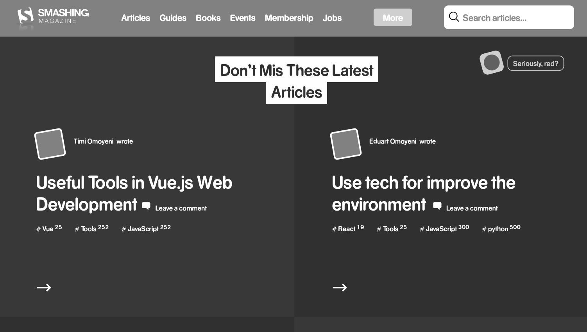

# HTML and CSS Smashing Magazine page clone

> This is an Smashing Magazine page clone made for an assignment of HTML/CSS.

We created this project using some images and buttons tags, also we used flex boxes, floats and gird systems for positioning.

## Built With

- HTML.
- CSS.
- VS Code.
- Git/GitHub.

## Live Demo

[Live Demo Link](https://kenderb.github.io/smaching-magazinne/)

## How to run it

To get a local copy up and running follow these simple steps.

* If you're using latest version of git.

* Clone this url https://github.com/kenderb/design-teardown.git on your local host.

* You have to use a Web explorer browser like Google Chrome or Mozilla Firefox to open the index.html file.

## Authors

👤 **KenderB**

- GitHub: [@kenderb](https://github.com/kenderb)
- Twitter: [@KBTarts](https://twitter.com/KBTarts)
- LinkedIn: [Kender Bolivar](https://www.linkedin.com/in/kender-bolivar-1736086b//)

## Show your support

Give a ⭐️ if you like this project!

## Acknowledgments

- Apple old plage clone.

## 📝 License

This project is [MIT](https://github.com/kenderb/design-teardown/blob/page/LICENSE) licensed.
